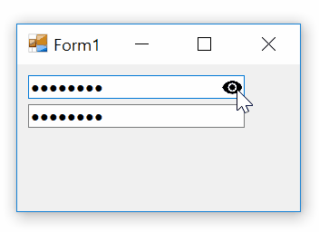

# TextBox with show password eye icon

In this example I've created a `TextBox` which shows a eye icon to show password if you click on icon and keep left mouse down ot it. It hides the password again as soon as you released the mouse button or move the mouse button out of the eye:

 
